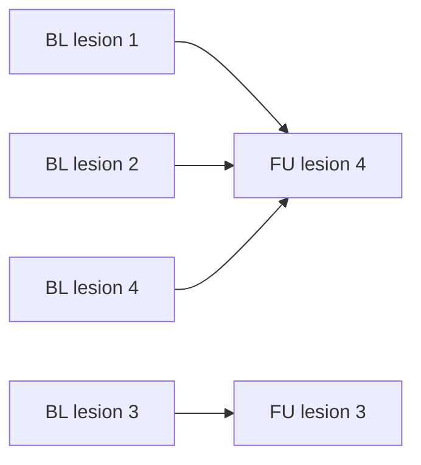

# Cohort A expert lesion correspondence inspection

This implementation adds a command-line tool for inspecting the expert-confirmed
baseline/follow-up lesion correspondences supplied with Cohort A. The expert CSV
is treated as ground truth for understanding and later evaluating lesion matching;
it is not used as an input feature by the future matcher.

## File

- `tools/inspect_cohort_a_correspondence.py` — inspects one patient's expert CSV
  in detail or summarises correspondence classes across all patients in a subset.

The tool consumes `cohort_a_subset_pairs.csv`, which is generated by
`tools/prepare_cohort_a_subset.py`. For each patient, it reads the path stored in
the manifest's `reference_csv_path` column. Path resolution is reused from
`src/cohort_a_loading.py`, so the tool supports absolute paths, paths relative to
the manifest, and paths relative to the Cohort A data root.

## Commands

### Inspect all patients in the subset

```powershell
python tools/inspect_cohort_a_correspondence.py `
  --pairs outputs/cohort_a_subset/cohort_a_subset_pairs.csv `
  --data-root ".\data"
```

When `--patient-id` is omitted, the tool:

1. visits every patient in the pair manifest;
2. loads the patient's expert correspondence CSV;
3. counts every observed `topology_class`;
4. reports the number of inspected and skipped patients; and
5. records one example patient and lesion ID for each observed class.

This mode is useful for discovering the relationship types that the future
matcher must support.

### Inspect one patient in detail

```powershell
python tools/inspect_cohort_a_correspondence.py `
  --pairs outputs/cohort_a_subset/cohort_a_subset_pairs.csv `
  --data-root ".\data" `
  --patient-id 0a09c8844b
```

For one patient, the tool prints:

- the resolved reference CSV path and number of correspondence rows;
- all available CSV columns and warnings for expected columns that are missing;
- counts of topology classes and lesion types;
- the number of links marked as unclear;
- any `lesion_id -> merged_into` relationships; and
- a compact table for manual review.

The `--data-root` argument may be omitted when `COHORT_A_ROOT` has been set:

```powershell
$env:COHORT_A_ROOT = "D:\path\to\Longitudinal_CT_v2"
python tools/inspect_cohort_a_correspondence.py `
  --pairs outputs/cohort_a_subset/cohort_a_subset_pairs.csv
```

## Arguments

| Argument | Required | Description |
|---|---:|---|
| `--pairs` | Yes | Path to `cohort_a_subset_pairs.csv`. |
| `--patient-id` | No | Patient to inspect in detail. If omitted, all manifest patients are summarised. |
| `--data-root` | Conditional | Cohort A root used to resolve `relative-to-root` paths. It can be replaced by `COHORT_A_ROOT`. |

## Expert correspondence format

Each patient has one expert CSV. Each row describes a lesion-level relationship
between the baseline (BL) and follow-up (FU) scans. The fields most relevant to
the current project are:

| Column | Interpretation |
|---|---|
| `lesion_id` | Expert lesion/correspondence identifier within the patient. |
| `cog_bl` | BL lesion centre of gravity in world coordinates. |
| `cog_backpropagated` | FU location propagated back to BL space, when provided. |
| `img_id_bl` | BL image identifier. |
| `cog_propagated` | BL lesion centre propagated into FU space by registration. |
| `cog_fu` | FU lesion centre of gravity in world coordinates. |
| `img_id_fu` | FU image identifier. |
| `lesion_type` | Anatomical lesion category, such as `Lymph node`. |
| `topology_class` | Expert-confirmed BL/FU relationship type. |
| `merged_into` | Target lesion identifier used for a merge relationship. |
| `volume_bl` | Expert BL lesion volume. |
| `volume_fu` | Expert FU lesion volume. |
| `target_lesion` | Whether the row is marked as a target lesion. |
| `use_for_challenge` | Whether the row is included for challenge/evaluation use. |
| `linking_unclear` | Whether the expert considers the correspondence uncertain. |

Blank coordinates or volumes are meaningful. For example, a disappearing lesion
can have BL information but no FU lesion information, while a newly appearing
lesion can have FU information but no BL lesion information.

## Observed findings

The tool was run on the current five-patient development subset. All five
patients were inspected successfully and none were skipped. A total of 39 expert
correspondence rows were found.

| Topology class | Count | Meaning for matching |
|---|---:|---|
| `UNCHANGED` | 23 | A BL lesion has a corresponding FU lesion; this is the ordinary matched case. |
| `DISAPPEARING` | 12 | A BL lesion has no corresponding lesion at FU. |
| `MERGING` | 3 | Multiple BL lesions correspond to one merged FU lesion. |
| `NEWLYAPPEARING` | 1 | An FU lesion has no corresponding lesion at BL. |

Example cases reported by the tool:

| Topology class | Example patient | Expert lesion ID |
|---|---|---:|
| `DISAPPEARING` | `0aa1883c64` | 1 |
| `MERGING` | `0a09c8844b` | 1 |
| `NEWLYAPPEARING` | `0e51011a4c` | 20 |
| `UNCHANGED` | `0a09c8844b` | 3 |

These counts describe only the selected five-patient development subset, not the
entire Cohort A dataset.

## Manual review: patient `0a09c8844b`

Patient `0a09c8844b` contains four expert correspondence rows. All four lesions
are labelled as `Lymph node`, all are enabled for challenge use, and none is
marked with `linking_unclear=True`.

| Lesion ID | Topology | `merged_into` | Interpretation |
|---:|---|---:|---|
| 1 | `MERGING` | 4 | BL lesion 1 contributes to FU merged lesion 4. |
| 2 | `MERGING` | 4 | BL lesion 2 contributes to FU merged lesion 4. |
| 3 | `UNCHANGED` | — | BL lesion 3 corresponds to a distinct FU lesion. |
| 4 | `MERGING` | 4 | BL lesion 4 contributes to FU merged lesion 4. |

Rows 1, 2, and 4 share the same `cog_fu` and `volume_fu`, confirming a
many-to-one relationship:



The merge example proves that the matching data model must not enforce a strict
one-to-one assignment.

## Relationship to alignment

The expert CSV distinguishes the original BL centre (`cog_bl`) from the BL centre
propagated into FU space (`cog_propagated`). This demonstrates why scan alignment
must be completed before distance-based lesion matching.

For unchanged lesion 3 in patient `0a09c8844b`:

- distance from `cog_bl` directly to `cog_fu`: approximately **42.27 mm**;
- distance from `cog_propagated` to `cog_fu`: approximately **2.20 mm**.

The much smaller propagated distance shows that raw BL and FU world coordinates
should not be compared directly when the patient position or scan geometry has
changed.

## Volume-unit note

The expert volume values are consistent with cubic millimetres, while
`src/lesion_components.py` exports `volume_ml`. Matcher evaluation must normalise
the units before comparing volumes:

```text
expert volume in mm³ / 1000 = volume in mL
```

The unit assumption should also be checked against the final dataset metadata
before volume-based evaluation is implemented.

## Expected future matcher interface

The correspondence CSV is evaluation ground truth. The future matcher should
instead consume lesions extracted from the BL and FU masks, together with the
output of the alignment stage.

Suggested matcher input fields:

```csv
patient_id,timepoint,temporary_lesion_id,volume_ml,centroid_x_mm,centroid_y_mm,centroid_z_mm,aligned_centroid_x_mm,aligned_centroid_y_mm,aligned_centroid_z_mm
```

The output should use one row per predicted BL-to-FU edge. This representation
supports ordinary matches, missing endpoints, and many-to-one merges:

```csv
patient_id,bl_lesion_id,fu_lesion_id,topology_class,match_score
0a09c8844b,0a09c8844b_BL_L003,0a09c8844b_FU_L003,UNCHANGED,0.96
0a09c8844b,0a09c8844b_BL_L001,0a09c8844b_FU_L004,MERGING,0.88
0a09c8844b,0a09c8844b_BL_L002,0a09c8844b_FU_L004,MERGING,0.91
0a09c8844b,0a09c8844b_BL_L004,0a09c8844b_FU_L004,MERGING,0.89
0aa1883c64,0aa1883c64_BL_L001,,DISAPPEARING,
0e51011a4c,,0e51011a4c_FU_L020,NEWLYAPPEARING,
```

This interface keeps three concerns separate:

1. lesion extraction creates temporary BL and FU lesion records;
2. alignment maps BL spatial information into FU space;
3. matching predicts correspondence edges, which are compared with the expert CSV.

## Acceptance-criteria mapping

- Expert correspondence format identified — documented in the field table above.
- BL identifiers and FU correspondence interpreted — covered by the topology and
  manual-review sections.
- Matched, disappeared, and newly appeared cases found — represented by
  `UNCHANGED`, `DISAPPEARING`, and `NEWLYAPPEARING`; `MERGING` was also observed.
- Example patient manually reviewed — patient `0a09c8844b`.
- Future matcher input/output documented — proposed schemas are provided above.
